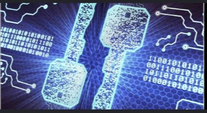
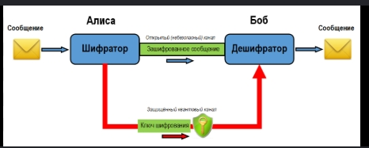
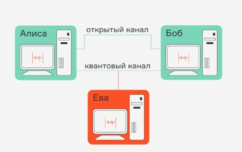
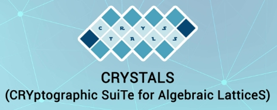
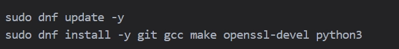
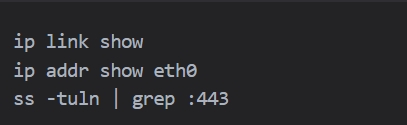

---
## Front matter
lang: ru-RU
title: Презентация по докладе
subtitle: Квантовое шифрование. Квантовая передача информации
author:
  - Гомес Лопес Теофания
institute:
  - Российский университет дружбы народов, Москва, Россия
date: 01 05 2026

## i18n babel
babel-lang: russian
babel-otherlangs: english

## Formatting pdf
toc: false
toc-title: Содержание
slide_level: 2
aspectratio: 169
section-titles: true
theme: metropolis
header-includes:
 - \metroset{progressbar=frametitle,sectionpage=progressbar,numbering=fraction}
---

# Выполнение лабораторной работы

## ВВЕДЕНИЕ

Квантовое шифрование и квантовая передача информации – это новые технологии защиты данных. Они используют законы квантовой физики, а не обычную математику. Сегодня большинство систем защищено алгоритмами RSA и ECC. Эти алгоритмы безопасны для классических компьютеров. Но квантовые компьютеры могут взломать их за короткое время. Поэтому учёные и инженеры разрабатывают новые методы.

{#fig:000 width=70%}

1. ЧТО ТАКОЕ КВАНТОВОЕ ШИФРОВАНИЕ И КВАНТОВАЯ ПЕРЕДАЧА ИНФОРМАЦИИ

## 1.1 Основные   понятия

Квантовая механика изучает поведение частиц на очень малом уровне (атомы, электроны, фотоны). У этих частиц есть необычные свойства:
Суперпозиция: частица может находиться в нескольких состояниях одновременно, пока её не измерят.
Запутанность: две частицы могут быть связаны. Изменение одной мгновенно влияет на другую, даже если они далеко друг от друга.
Принцип неопределённости Гейзенберга: нельзя точно измерить все параметры частицы одновременно. Любое измерение меняет её состояние.
Эти свойства используют в криптографии. Если злоумышленник попытается перехватить квантовый сигнал, он изменит состояние частиц. Отправитель и получатель сразу заметят ошибку. Это делает канал передачи теоретически неуязвимым к прослушиванию.

{#fig:001 width=70%}

## 1.2. Чем квантовое шифрование отличается от обычного?

| Обычное шифрование | Квантовое шифрование |
| :--- | :--- |
| Основано на сложных математических задачах (факторизация, дискретный логарифм) | Основано на законах физики |
| Безопасность зависит от вычислительной мощности атакующего | Безопасность зависит от законов природы |
| Можно скопировать данные без изменений | Квантовые данные нельзя скопировать (теорема о запрете клонирования) |
| Угроза со стороны квантовых компьютеров | Устойчиво к любым вычислительным атакам |

## 1.3. Квантовая передача информации

Информация передаётся с помощью квантовых состояний. Чаще всего используют поляризацию фотонов. Отправитель (Алиса) отправляет фотоны через оптоволокно или воздух. Получатель (Боб) измеряет их. Если канал чистый, они создают общий секретный ключ. Этот ключ потом используют для обычного шифрования данных (например, AES-256). Такой процесс называется QKD – Quantum Key Distribution (квантовое распределение ключей).

{#fig:002 width=70%}

2. КАК РАБОТАЮТ КВАНТОВЫЕ ПРОТОКОЛЫ

## 2.1. Протокол BB84

Это первый и самый известный протокол QKD. Его создали Чарльз Беннет и Жиль Брассар в 1984 году.
Алиса отправляет фотоны в случайных базисах (например, вертикальный/горизонтальный или диагональный).
Боб случайно выбирает базисы для измерения.
После передачи они открыто обсуждают, какие базисы совпали (но не сами результаты).
Оставляют только совпавшие измерения. Это и есть сырой ключ.
Проверяют уровень ошибок. Если ошибок мало, канал безопасен. Если много – значит, была попытка прослушки.

{#fig:003 width=70%}

## 2.2. Протокол E91

Использует запутанные пары фотонов. Алиса и Боб получают по одному фотону из пары. Их измерения всегда коррелируют. Любое вмешательство разрушает запутанность. Этот протокол сложнее, но даёт более высокую защиту.

## 2.3. Ограничения на практике

Расстояние: обычно до 100–200 км по оптоволокну. Дальше сигнал затухает.
Скорость: генерация ключей медленнее, чем в классических системах.
Оборудование: дорогие детекторы, стабилизированные лазеры, контроль температуры.
Интеграция: требует специальных контроллеров и ПО.

3. ПОСТКВАНТОВАЯ КРИПТОГРАФИЯ: РЕШЕНИЕ ДЛЯ СЕГОДНЯ

Постквантовая криптография (PQC) – это математические алгоритмы, которые работают на обычных процессорах, но устойчивы к атакам квантовых компьютеров. В 2024 году NIST утвердил первые стандарты:
CRYSTALS-Kyber – для обмена ключами,
CRYSTALS-Dilithium – для цифровых подписей,
SPHINCS+ – альтернативная схема подписей.
Эти алгоритмы уже доступны в Linux через библиотеки. Их можно установить и протестировать на Rocky Linux без специального оборудования.

{#fig:004 width=70%}

4. ROCKY LINUX

Ниже приведены практические команды. 

## 4.1. Обновление системы и установка базовых инструментов

{#fig:005 width=70%}

## 5.3. Настройка сети для тестирования безопасного канала

Квантовые и постквантовые системы требуют стабильной сети. Проверьте параметры интерфейса:

{#fig:006 width=70%}

# Выводы

Квантовое шифрование и квантовая передача информации – это перспективные технологии. Они обещают абсолютную защиту данных на уровне физических законов. Протоколы вроде BB84 и E91 уже работают в лабораториях и ограниченных коммерческих сетях. Но для массового использования нужно дорогое оборудование и специальные каналы связи.
На обычных серверах, включая Rocky Linux, пока нельзя запустить реальную квантовую передачу. Но можно готовиться к будущему. Постквантовая криптография уже доступна. Библиотеки вроде Open Quantum Safe позволяют тестировать новые алгоритмы. Команды Linux помогают настраивать сеть, проверять трафик и обновлять службы.
Главный вывод: не нужно ждать появления квантовых компьютеров, чтобы начать защиту. Уже сегодня можно внедрять постквантовые стандарты, обучать команды и тестировать инфраструктуру. Rocky Linux подходит для этих задач благодаря стабильности, долгой поддержке и совместимости с современными криптографическими инструментами.
Будущее квантовой безопасности начнётся с правильной подготовки сегодня.

# Список литературы{.unnumbered}

Bennett, C. H., & Brassard, G. (1984). Quantum cryptography: Public key distribution and coin tossing. Proceedings of IEEE International Conference on Computers, Systems and Signal Processing, 175–179.
National Institute of Standards and Technology (NIST). (2024). Post-Quantum Cryptography Standardization. https://csrc.nist.gov/projects/post-quantum-cryptography
Open Quantum Safe Project. (2025). Documentation & GitHub Repository. https://github.com/open-quantum-safe
Rocky Linux Documentation. (2026). Security & Networking Guides. https://docs.rockylinux.org
