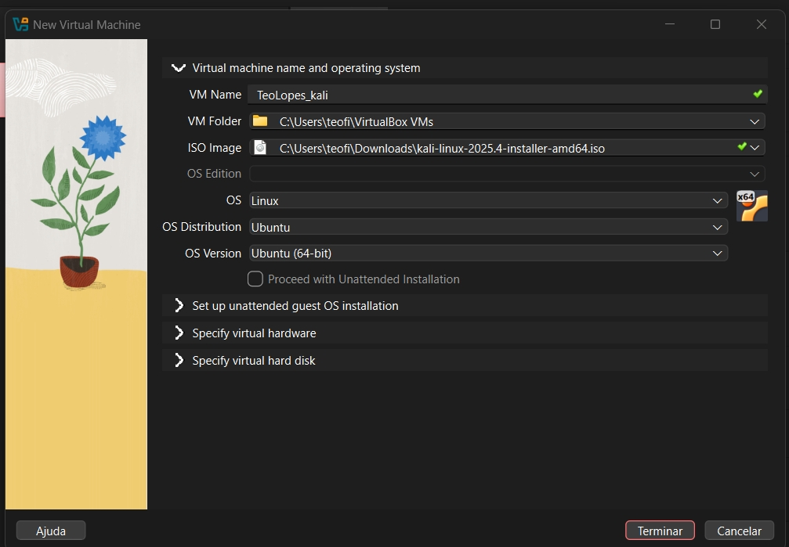
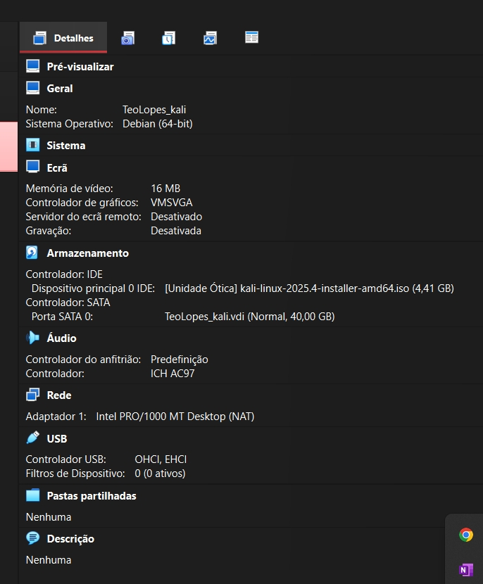
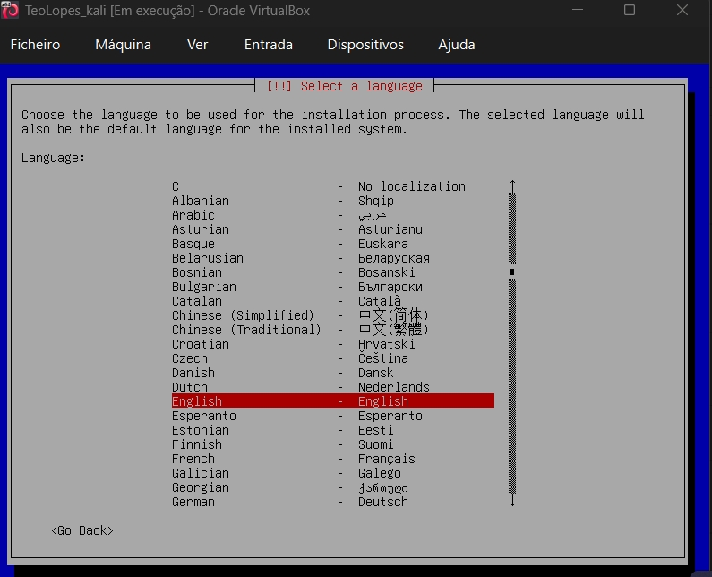
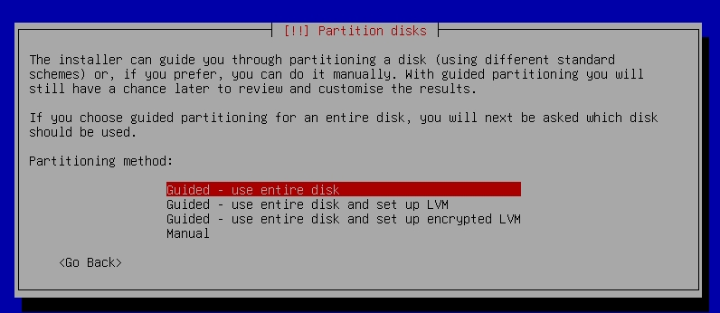
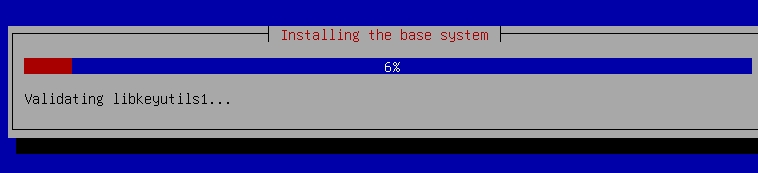
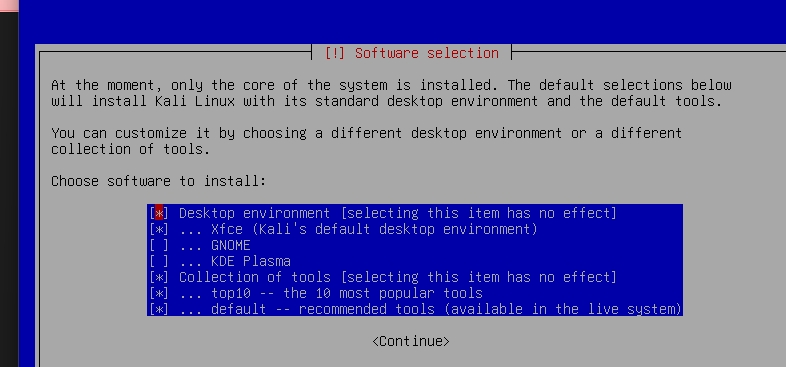

---
## Front matter
lang: ru-RU
title: Структура по индивидуальному проекту этап 1
subtitle: Установка Kali Linux
author:
  - Гомес Лопес Теофания
institute:
  - Российский университет дружбы народов, Москва, Россия
date: 06 03 2026

## i18n babel
babel-lang: russian
babel-otherlangs: english

## Formatting pdf
toc: false
toc-title: Содержание
slide_level: 2
aspectratio: 169
section-titles: true
theme: metropolis
header-includes:
 - \metroset{progressbar=frametitle,sectionpage=progressbar,numbering=fraction}
---

# Цель работы

Я научился устанавливать операционные системы на виртуальные машины.

# Задание

Установить дистрибутив Linux.

# Выполнение лабораторной работы

## Название машины

{#fig:001 width=70%}

## Итог

{#fig:002 width=70%}

## Окно установки

{#fig:003 width=70%}

## Подключенный образ

{#fig:003 width=70%}

## язык установки

{#fig:004 width=70%}

## Локация 

{#fig:005 width=70%}

## конфигурация клавиатуры (язык).

{#fig:006 width=70%}

## Настройки сети 

{#fig:007 width=70%}

## Создание пользователя 

{#fig:008 width=70%}

## Настройки часов

{#fig:009 width=70%}

## Выбор диска 

{#fig:0010 width=70%}

## Установка системы

{#fig:011 width=70%}

## Выбор UI

{#fig:012 width=70%}

## Домашний экран 

{#fig:013 width=70%}

## Пустой носитель

{#fig:019 width=70%}

# Выводы

Я научилась устанавливать ОС на виртуальные машины.
