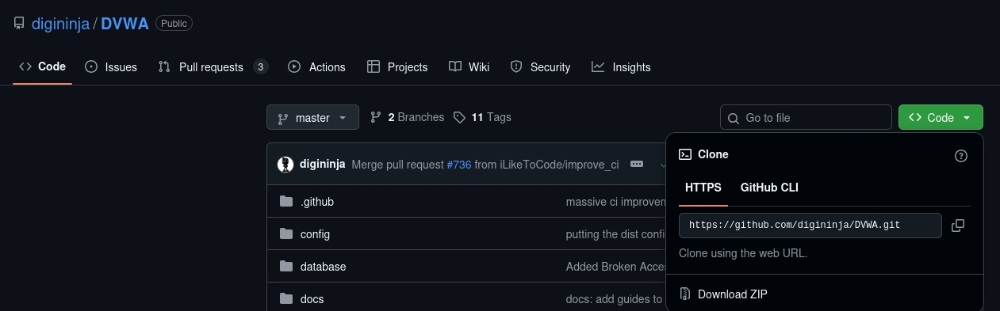
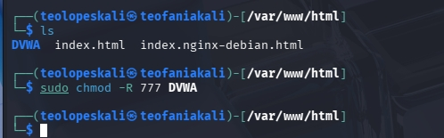
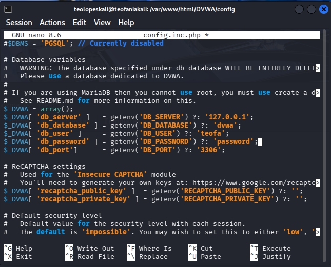
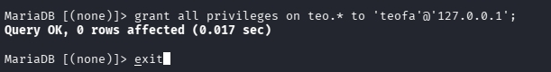
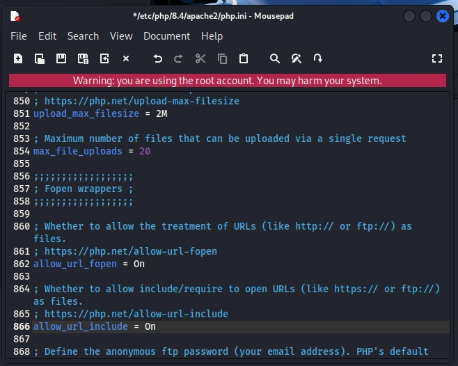
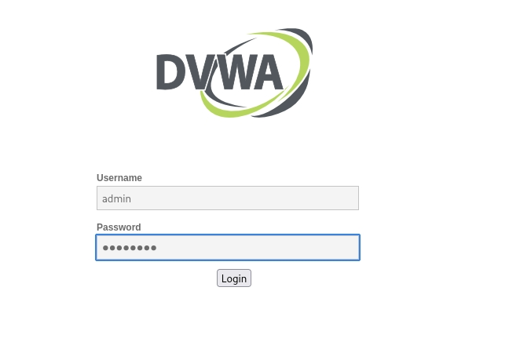

---
## Front matter
lang: ru-RU
title: Структура по индивидуальному проекту этап 2
subtitle: Установка DVWA
author:
  - Гомес Лопес Теофания
institute:
  - Российский университет дружбы народов, Москва, Россия
date: 20 03 2026

## i18n babel
babel-lang: russian
babel-otherlangs: english

## Formatting pdf
toc: false
toc-title: Содержание
slide_level: 2
aspectratio: 169
section-titles: true
theme: metropolis
header-includes:
 - \metroset{progressbar=frametitle,sectionpage=progressbar,numbering=fraction}
---

# Цель работы

Получить практические навыки по установке DVWA.

# Задание

1. Установить DVWA.

# Выполнение лабораторной работы

## репзиторий DVWA

Открываю GitHub, нахожу репозиторий DVWA и копирую его ссылку.

{#fig:001 width=70%}

## Клонирование DVWA в /html

Открываю терминал, командой cd вхожу в директорию html (здесь хранятся файлы локального хоста) и клонирую репозиторий.

{#fig:002 width=70%}

## chmod -R 777

С помощью ls проверяю, что клонирование прошло успешно, затем с помощью chmod -R 777 разрешаю все права на все файлы в директории DVWA.

{#fig:003 width=70%}

## копирование config.int.php

Затем копирую config.inc.php — файл с настройками конфигурации приложения.

{#fig:005 width=70%}

## редактирование файла конфигурации

В этом файле изменяю пароль, имя пользователя на  mwaku и создаю базу данных waku и сохраняю изменения.

{#fig:006 width=70%}

## проверка работы mysql

{#fig:008 width=70%}

## вход в mysql

Далее я вхожу в mmysql используя mysql -u root -p 

{#fig:009 width=70%}

## создание пользоателя

Создаю базу данных teo и нового пользователя используя create user 'teofa'@'127.0.0.1' identified by 'password'. Используя эту команду, создала пользователя teofa, работаюшего на сервер локального хоста (127.0.0.1) и пароль password.

{#fig:010 width=70%}

## Разрешение права

Предоставляю этому пользователю все права на базу данных и завершаю работу.

{#fig:011 width=70%}

## вход в /etc/php/8.2

Далее вхожу в /etc/php/8.4. 

{#fig:013 width=70%}

## Включение  allow_url

Включаю значения allow_url_fopen и allow_url_include в файле apache2/php.ini.

{#fig:014 width=70%}

## Перезапуск apache2

Перезапускаю сервер Apache2 с помощью systemctl restart apache2.

{#fig:015 width=70%}

## страница веб-приложения

Открою 127.0.0.1./DVWA/setup.php в браузере.

{#fig:016 width=70%}

## Вход в DVWA

Нажимаю кнопку Create/Reset Database. Происходит создание базы данных, и автоматически выполняется переход на страницу входа. Для входа использую учетные данные: логин admin, пароль password

{#fig:017 width=70%}

## Домшняя страница dvwa

После входа попадаю на домашнюю страницу DVWA.

{#fig:018 width=70%}

# Выводы

В результате работы я получила навыки по установке DVWA.

