---
## Front matter
title: "Отчёт по индивидуальному проекту этап 2"
subtitle: "Установка DVWA"
author: "Гомес Лопес Теофания"

## Generic otions
lang: ru-RU
toc-title: "Содержание"

## Bibliography
bibliography: bib/cite.bib
csl: pandoc/csl/gost-r-7-0-5-2008-numeric.csl

## Pdf output format
toc: true # Table of contents
toc-depth: 2
lof: true # List of figures
lot: true # List of tables
fontsize: 12pt
linestretch: 1.5
papersize: a4
documentclass: scrreprt
## I18n polyglossia
polyglossia-lang:
  name: russian
  options:
	- spelling=modern
	- babelshorthands=true
polyglossia-otherlangs:
  name: english
## I18n babel
babel-lang: russian
babel-otherlangs: english
## Fonts
mainfont: IBM Plex Serif
romanfont: IBM Plex Serif
sansfont: IBM Plex Sans
monofont: IBM Plex Mono
mathfont: STIX Two Math
mainfontoptions: Ligatures=Common,Ligatures=TeX,Scale=0.94
romanfontoptions: Ligatures=Common,Ligatures=TeX,Scale=0.94
sansfontoptions: Ligatures=Common,Ligatures=TeX,Scale=MatchLowercase,Scale=0.94
monofontoptions: Scale=MatchLowercase,Scale=0.94,FakeStretch=0.9
mathfontoptions:
## Biblatex
biblatex: true
biblio-style: "gost-numeric"
biblatexoptions:
  - parentracker=true
  - backend=biber
  - hyperref=auto
  - language=auto
  - autolang=other*
  - citestyle=gost-numeric
## Pandoc-crossref LaTeX customization
figureTitle: "Рис."
tableTitle: "Таблица"
listingTitle: "Листинг"
lofTitle: "Список иллюстраций"
lotTitle: "Список таблиц"
lolTitle: "Листинги"
## Misc options
indent: true
header-includes:
  - \usepackage{indentfirst}
  - \usepackage{float} # keep figures where there are in the text
  - \floatplacement{figure}{H} # keep figures where there are in the text
---

# Цель работы

Получить практические навыки по установке DVWA.

# Задание

1. Установить DVWA.

# Выполнение лабораторной работы

Открываю GitHub, нахожу репозиторий DVWA и копирую его ссылку.

{#fig:001 width=70%}

Открываю терминал, командой cd вхожу в директорию html (здесь хранятся файлы локального хоста) и клонирую репозиторий.

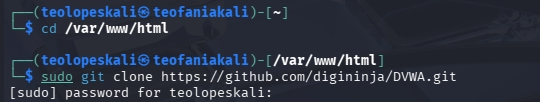{#fig:002 width=70%}

С помощью ls проверяю, что клонирование прошло успешно, затем с помощью chmod -R 777 разрешаю все права на все файлы в директории DVWA.

{#fig:003 width=70%}

Проверяю работу и захожу в dvwa/config, чтобы настроить веб-приложение.

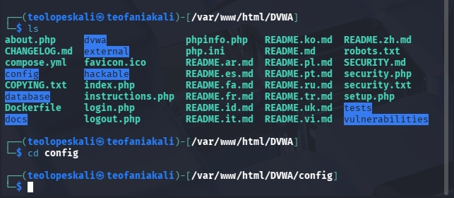{#fig:004 width=70%}

Затем копирую config.inc.php — файл с настройками конфигурации приложения.

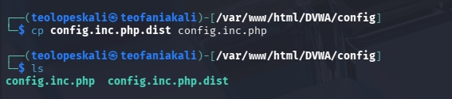{#fig:005 width=70%}

В этом файле изменяю пароль, имя пользователя на  mwaku и создаю базу данных waku и сохраняю изменения.

{#fig:006 width=70%}

Запускаю службу MySQL командой start mysql и проверяю, что она работает, с помощью status mysql.

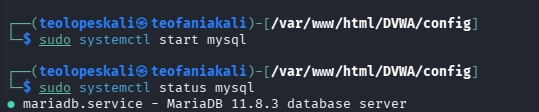{#fig:007 width=70%}

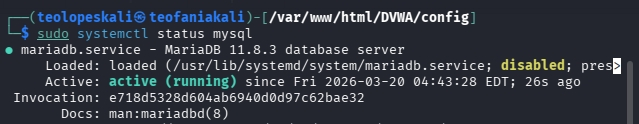{#fig:008 width=70%}

Далее я вхожу в mmysql используя mysql -u root -p 

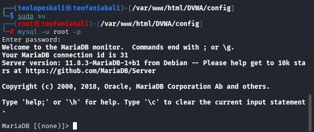{#fig:009 width=70%}

Создаю базу данных teo и нового пользователя используя create user 'teofa'@'127.0.0.1' identified by 'password'. Используя эту команду, создала пользователя teofa, работаюшего на сервер локального хоста (127.0.0.1) и пароль password.

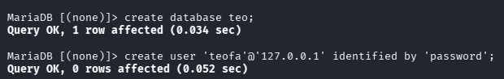{#fig:010 width=70%}

Предоставляю этому пользователю все права на базу данных и завершаю работу.

{#fig:011 width=70%}

Запускаю сервер apache2.

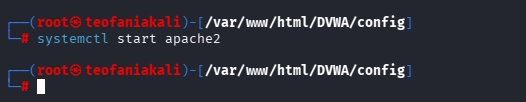{#fig:012 width=70%}

Далее вхожу в /etc/php/8.4. 

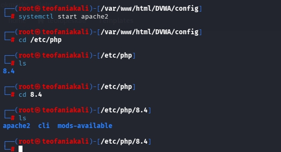{#fig:013 width=70%}

Включаю значения allow_url_fopen и allow_url_include в файле apache2/php.ini.

{#fig:014 width=70%}

Перезапускаю сервер Apache2 с помощью systemctl restart apache2.

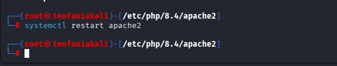{#fig:015 width=70%}

Открою 127.0.0.1./DVWA/setup.php в браузере.

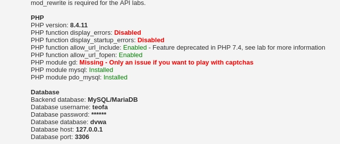{#fig:016 width=70%}

Нажимаю кнопку Create/Reset Database. Происходит создание базы данных, и автоматически выполняется переход на страницу входа. Для входа использую учетные данные: логин admin, пароль password

{#fig:017 width=70%}

После входа попадаю на домашнюю страницу DVWA.

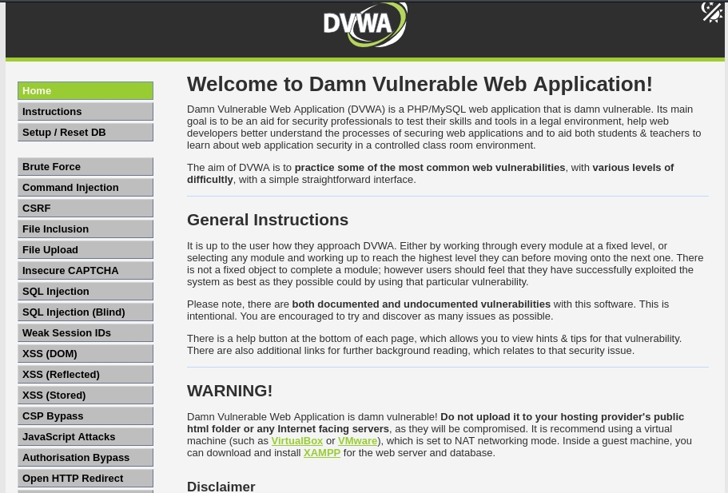{#fig:018 width=70%}

# Выводы

В результате работы я получила навыки по установке DVWA.

