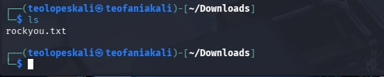
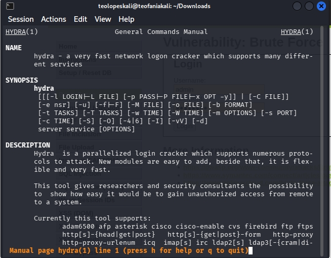
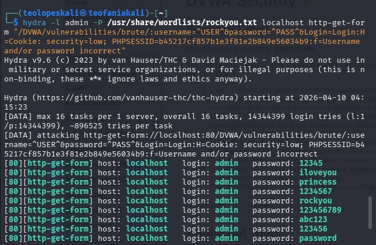

---
## Front matter
lang: ru-RU
title: Структура по индивидуальному проекту этап 3
subtitle: HYDRA
author:
  - Гомес Лопес Теофания
institute:
  - Российский университет дружбы народов, Москва, Россия
date: 10 04 2026

## i18n babel
babel-lang: russian
babel-otherlangs: english

## Formatting pdf
toc: false
toc-title: Содержание
slide_level: 2
aspectratio: 169
section-titles: true
theme: metropolis
header-includes:
 - \metroset{progressbar=frametitle,sectionpage=progressbar,numbering=fraction}
---

# Цель работы

Цель работы — получить практические навыки использования Hydra для подбора паролей (брутфорса).

# Задание

Реализовать атаку на уязвимость, используя брутфорс (подбор паролей).

# Выполнение лабораторной работы

## Загружаю список паролей.

Перед началом работы я подготовила список часто встречающихся паролей. Проверяю, что список на месте, и продолжаю работу.

{#fig:001 width=70%}

## VWA — домашняя страница

Затем вхожу в аккаунт DVWA, который создала в предыдущей работе, и перехожу в раздел Brute Force.

{#fig:002 width=70%}

## информация по hydra

Использую команду man, чтобы изучить справку Hydra и разобраться в её работе. Для выполнения задачи мне нужны опции -l (указывает логин) и -p (указывает пароль).

{#fig:003 width=70%}

## пароль

Выполняю подбор пароля для пользователя admin с помощью файла rockyou.txt. Использую GET-запрос, передавая параметры cookie и PHPSESSID. При указании опции -P программа показывает подобранный пароль и путь к файлу со списком паролей (home/mwakutaipa/rockyou.txt)

{#fig:004 width=70%}

## Проверка

Использую найденный пароль для входа в систему, чтобы убедиться, что пароль верный.

{#fig:005 width=70%}

# Выводы

В результате выполнения работы я получила практические навыки использования Hydra для подбора паролей (брутфорса).

