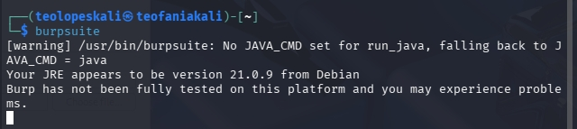
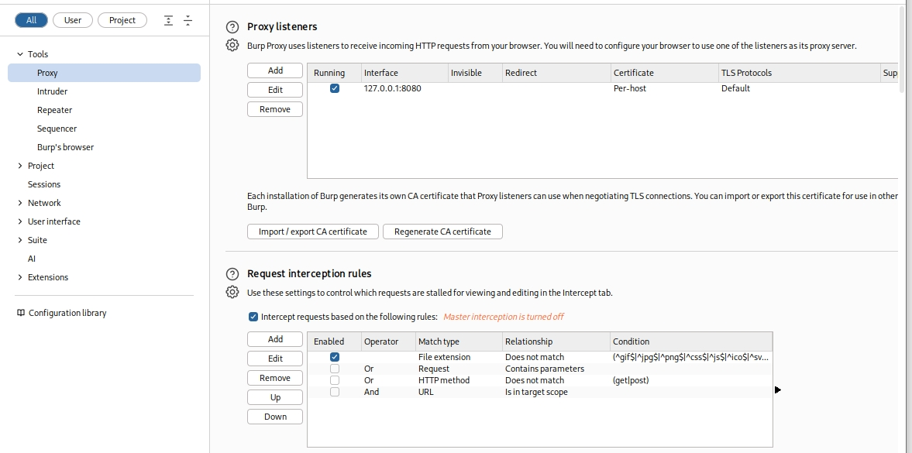
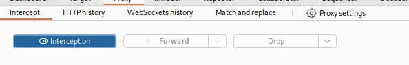
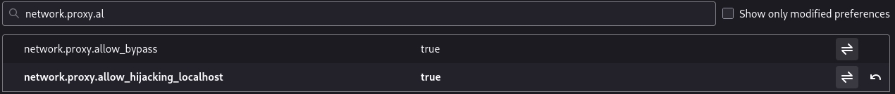
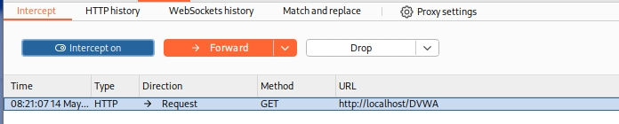
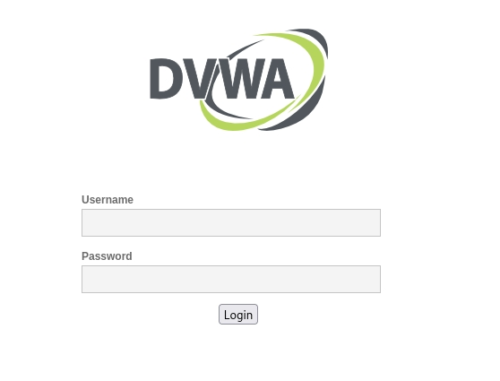
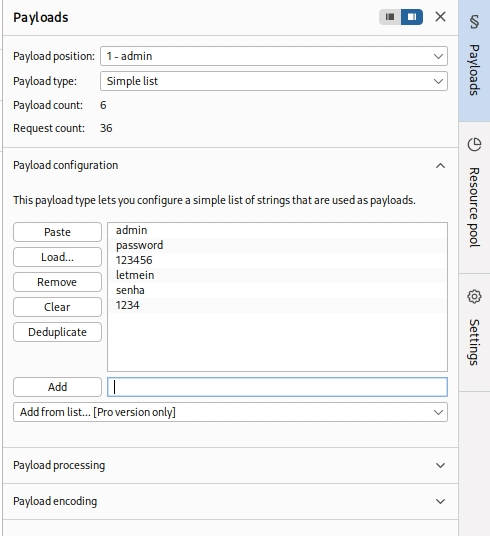
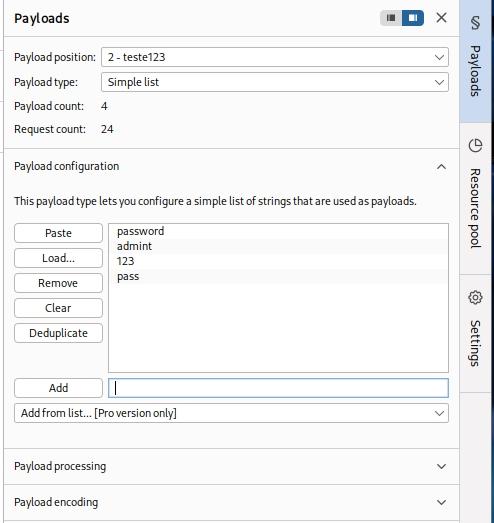

---
## Front matter
lang: ru-RU
title: Структура по индивидуальному проекту этап 5
subtitle: Burp Suite
author:
  - Гомес Лопес Теофания
institute:
  - Российский университет дружбы народов, Москва, Россия
date: 14 05 2026

## i18n babel
babel-lang: russian
babel-otherlangs: english

## Formatting pdf
toc: false
toc-title: Содержание
slide_level: 2
aspectratio: 169
section-titles: true
theme: metropolis
header-includes:
 - \metroset{progressbar=frametitle,sectionpage=progressbar,numbering=fraction}
---

# Цель работы

Научиться использовть Burp Suite.

# Выполнение лабораторной работы

## Запуск сервера

Запускаю локальный серевер DVWA: 

{#fig:001 width=70%}

## Запуск Burp suite

Запускаю burp suite:

{#fig:002 width=70%}

## сетевые настройки сервера

Я захожу в сетевые настройки браузера и настраиваю прокси-сервер так, чтобы браузер работал через Burp Suite — это позволит перехватывать данные.

{#fig:003 width=70%}

## настройки proxy

В Burp Suite я меняю параметры прокси.

{#fig:004 width=70%}

## Включение intercept

Включаю intercept во вкладе proxy:

{#fig:005 width=70%}

## Установка параметра локального хоста

Чтобы Burp Suite работал с локальным сервером, требуется изменить параметр network_allow_hijacking_localhost на true. Я выполнила эту настройку.

{#fig:006 width=70%}

## вкладка proxy

вкладка proxy

{#fig:007 width=70%}

## окно dvwa

{#fig:008 width=70%}

## Измененные данные

При вводе неверных логина и пароля в запросе отображаются введённые данные. Я отправила этот запрос в Intruder (send to intruder) через вкладку Target. Во вкладке Intruder изменила тип атаки на Cluster Bomb и данные для входа.

{#fig:009 width=70%}

## Тип атака

{#fig:010 width=70%}

## Список 1

Отметила два параметра для подбора, поэтому создала два списка со значениями для подбора в payload:

{#fig:011 width=70%}

## Список 2

{#fig:012 width=70%}

## Правильная пара

Запускаю атаку и начинаю подбор. При открытии POST-запроса виден GET-запрос — туда перенаправило после ввода пары. 

{#fig:013 width=70%}

## Полученная страница

В подокне Render получаю то, как выглядит полученная страница:

{#fig:0144 width=70%}

# Выводы

Научилась использовать Burp Suite.

