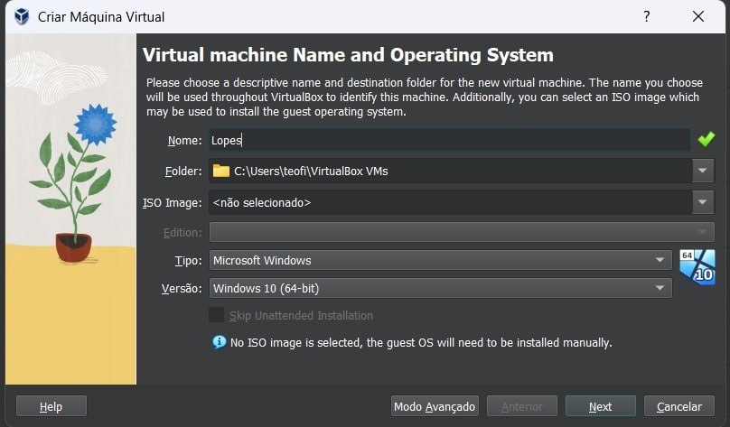
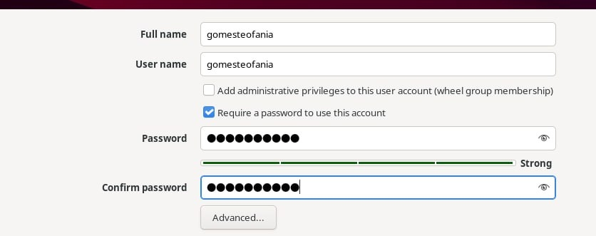
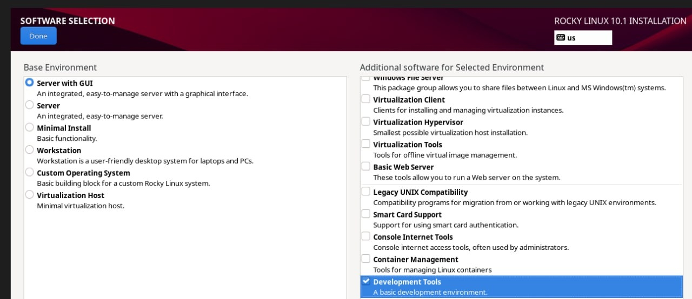

---
## Front matter
lang: ru-RU
title: Презентация по лабораторной работе 1
subtitle: Установка и Конфигурация ОС на Виртуальную Машину"
author:
  - Гомес Лопес Теофания
institute:
  - Российский университет дружбы народов, Москва, Россия
date: 01 02 2026

## i18n babel
babel-lang: russian
babel-otherlangs: english

## Formatting pdf
toc: false
toc-title: Содержание
slide_level: 2
aspectratio: 169
section-titles: true
theme: metropolis
header-includes:
 - \metroset{progressbar=frametitle,sectionpage=progressbar,numbering=fraction}
---

## Цели и задачи

Получение практических навыков установки операционной системы на виртуальную машину

## Задачи

1. Установить и настроить Rocky Linux.
2. Найти следующую информацию:
	1. Версия Linux
	2. Частота процессора
	3. Модель процессора
	4. Объем доступной оперативной памяти
	5. Тип обнаруженного гипервизора
	6. Тип файловой системы корневого раздела
	7. Последовательность монтирования файловых систем
	
	
# Выполнение лабораторной работы

Для начала я создаю новую виртуальную машину в VirtualBox. Потом мне нужно указать её имя и добавить оптический диск.

{#fig:001 width=70%}

## Настроики

Указываю обьем памяти и создаю виртуальнный жетский диск.

{#fig:002 width=70%}

## Настроики

{#fig:003 width=70%}

## Настроики

Я соглашаюсь с этими настройками.

{#fig:004 width=70%}

## Настроики

Проверяю подключения диска в носителях образ.

{#fig:005 width=70%}

## Настроики

Выбираю место установки, отключаю kdump, создаю пользователя (администратор) и устанавливаю пароль для администратора. 

{#fig:007 width=70%}

## Настроики

{#fig:008 width=70%}

## Настроики

{#fig:009 width=70%}

## Настроики

{#fig:0010 width=70%}

## Установка

Затем устанавливаю систему.
 
{#fig:0012 width=70%}

## Информация о системе

dmesg | grep -i "detected", чтобы получить информацию о процессоре.

{#fig:0014 width=70%}

## Информация о системе

dmesg | grep -i "CPU", чтобы получить информацию о модели процессора.

{#fig:0019 width=70%}

# Выводы
На практике я научилась устанавливать операционную систему на виртуальную машину и настраивать минимально необходимые сервисы для работы.
