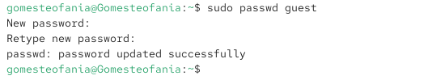
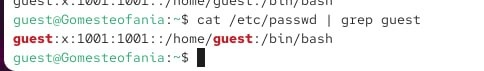
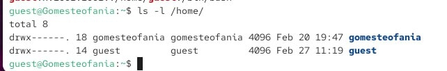

---
## Front matter
lang: ru-RU
title: Презентация по лабораторной работе 2
subtitle: Основные артрибуты
author:
  - Гомес Лопес Теофания
institute:
  - Российский университет дружбы народов, Москва, Россия
date: 27 02 2026

## i18n babel
babel-lang: russian
babel-otherlangs: english

## Formatting pdf
toc: false
toc-title: Содержание
slide_level: 2
aspectratio: 169
section-titles: true
theme: metropolis
header-includes:
 - \metroset{progressbar=frametitle,sectionpage=progressbar,numbering=fraction}
---

# Цель работы

Получить практические навыки работы с правами доступа к файлам в консоли Linux и понять, как работает дискреционное управление доступом.

# Задание

1. Работа с атрибутами  файлов
2. Заполнение таблиц

# Выполнение лабораторной работы

## Атрибуты файлов
От имени администратора создаю пользователя guest и задаю ему пароль

{#fig:001 width=70%}

## Атрибуты файлов

{#fig:002 width=70%}

## Атрибуты файлов

Захожу в систему как пользователь guest и выполняю команду pwd, чтобы узнать, где я нахожусь.

{#fig:004 width=70%}

## Атрибуты файлов

Уточняю имя пользователя.

{#fig:005 width=70%}

## Атрибуты файлов

Groups выводит информция о названии группы, к которой относится пользователь. id выводит больше информации чем groups (имя пользователя и группыб коды группы и пользователя). 

{#fig:006 width=70%}

## Атрибуты файлов

С помощью cat /etc/passwd | grep guest вывожу свою учетную запись и адрес домашней директории. 

{#fig:008 width=70%}

## Атрибуты файлов

Создаю поддиректорию dir1 для домашней директории.

{#fig:011 width=70%}

## Атрибуты файлов

Расширенные атрибуты командой lsattr просмотреть у директории не удается, но атрибуты есть: drwxr-xr-x, их удалось просмотреть с помощью команды ls -l

{#fig:012 width=70%}

## Атрибуты файлов

{#fig:013 width=70%}

## Атрибуты файлов

Снимаю атрибуты с директории dir1 командой chmod 000 dir1. Проверяю с помощью ls -l — теперь атрибуты действительно сняты.

{#fig:014 width=70%}

## Атрибуты файлов

Попытка создать файл в директории dir1. Выдает отказано в доступе. Вернув права директории и использовав снова командy ls -l можно убедиться, что файл не был создан.

# Выводы

Выполнив работу, я получила практические навыки работы с атрибутами файлов в консоли и закрепила теорию дискреционного разграничения доступа в Linux.

