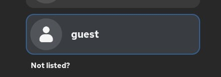
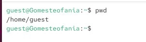
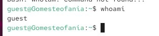
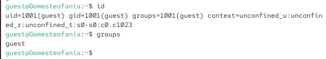
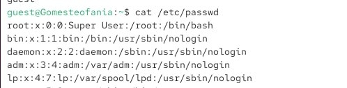
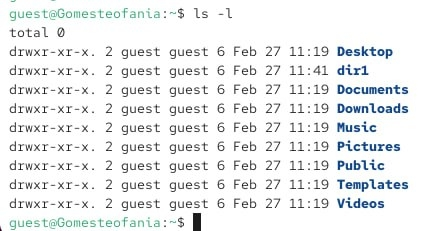
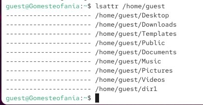
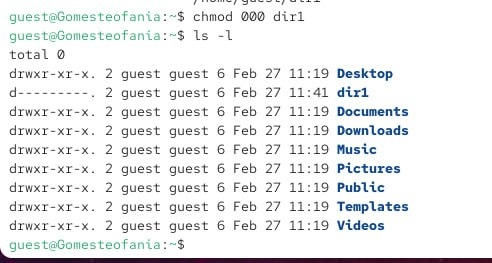

---
## Front matter
title: "Отчёта по лабораторной работе 2"
subtitle: "Дискреционное разграничение правил в Linux. Основные артрибуты"
author: "Гомес Лопес Теофания"

## Generic otions
lang: ru-RU
toc-title: "Содержание"

## Bibliography
bibliography: bib/cite.bib
csl: pandoc/csl/gost-r-7-0-5-2008-numeric.csl

## Pdf output format
toc: true # Table of contents
toc-depth: 2
lof: true # List of figures
lot: true # List of tables
fontsize: 12pt
linestretch: 1.5
papersize: a4
documentclass: scrreprt
## I18n polyglossia
polyglossia-lang:
  name: russian
  options:
	- spelling=modern
	- babelshorthands=true
polyglossia-otherlangs:
  name: english
## I18n babel
babel-lang: russian
babel-otherlangs: english
## Fonts
mainfont: IBM Plex Serif
romanfont: IBM Plex Serif
sansfont: IBM Plex Sans
monofont: IBM Plex Mono
mathfont: STIX Two Math
mainfontoptions: Ligatures=Common,Ligatures=TeX,Scale=0.94
romanfontoptions: Ligatures=Common,Ligatures=TeX,Scale=0.94
sansfontoptions: Ligatures=Common,Ligatures=TeX,Scale=MatchLowercase,Scale=0.94
monofontoptions: Scale=MatchLowercase,Scale=0.94,FakeStretch=0.9
mathfontoptions:
## Biblatex
biblatex: true
biblio-style: "gost-numeric"
biblatexoptions:
  - parentracker=true
  - backend=biber
  - hyperref=auto
  - language=auto
  - autolang=other*
  - citestyle=gost-numeric
## Pandoc-crossref LaTeX customization
figureTitle: "Рис."
tableTitle: "Таблица"
listingTitle: "Листинг"
lofTitle: "Список иллюстраций"
lotTitle: "Список таблиц"
lolTitle: "Листинги"
## Misc options
indent: true
header-includes:
  - \usepackage{indentfirst}
  - \usepackage{float} # keep figures where there are in the text
  - \floatplacement{figure}{H} # keep figures where there are in the text
---

# Цель работы

Получить практические навыки работы с правами доступа к файлам в консоли Linux и понять, как работает дискреционное управление доступом.

# Задание

1. Работа с атрибутами  файлов
2. Заполнение таблиц

# Выполнение лабораторной работы

## Атрибуты файлов
От имени администратора создаю пользователя guest и задаю ему пароль

{#fig:001 width=70%}

{#fig:002 width=70%}

Захожу в систему как пользователь guest и выполняю команду pwd, чтобы узнать, где я нахожусь.

{#fig:003 width=70%}

{#fig:004 width=70%}

Уточняю имя пользователя.

{#fig:005 width=70%}

Groups выводит информция о названии группы, к которой относится пользователь. id выводит больше информации чем groups (имя пользователя и группыб коды группы и пользователя). 

{#fig:006 width=70%}

Чтобы просмотреть содержимое файла /etc/passwd, используйте команду cat.

{#fig:007 width=70%}

С помощью cat /etc/passwd | grep guest вывожу свою учетную запись и адрес домашней директории. 

{#fig:008 width=70%}

Список поддиректорий в домашней директории получилось вывести с помощью команды ls -l

{#fig:009 width=70%}

{#fig:010 width=70%}

Создаю поддиректорию dir1 для домашней директории.

{#fig:011 width=70%}

Расширенные атрибуты командой lsattr просмотреть у директории не удается, но атрибуты есть: drwxr-xr-x, их удалось просмотреть с помощью команды ls -l

{#fig:012 width=70%}

{#fig:013 width=70%}

Снимаю атрибуты с директории dir1 командой chmod 000 dir1. Проверяю с помощью ls -l — теперь атрибуты действительно сняты.

{#fig:014 width=70%}

Попытка создать файл в директории dir1. Выдает отказано в доступе. Вернув права директории и использовав снова командy ls -l можно убедиться, что файл не был создан.

## . Заполнение таблицы 2.1

| Права директории | Права файла | Создание файла | Удаление файла | Запись в файл | Чтение файла | Смена директории | Просмотр файлов в директории | Переименование файла | Права на атрибуты файла |
|------------------|-------------|----------------|----------------|---------------|--------------|------------------|------------------------------|----------------------|-------------------------|
| d(000) | (000) | - | - | - | - | - | - | - | - |
| d(000) | (100) | - | - | - | - | - | - | - | - |
| d(000) | (200) | - | - | - | - | - | - | - | - |
| d(000) | (300) | - | - | - | - | - | - | - | - |
| d(000) | (400) | - | - | - | - | - | - | - | - |
| d(000) | (500) | - | - | - | - | - | - | - | - |
| d(000) | (600) | - | - | - | - | - | - | - | - |
| d(000) | (700) | - | - | - | - | - | - | - | - |
| d(100) | (000) | - | - | - | - | + | - | - | - |
| d(100) | (100) | - | - | - | - | + | - | - | - |
| d(100) | (200) | - | - | + | - | + | - | - | - |
| d(100) | (300) | - | - | + | - | + | - | - | - |
| d(100) | (400) | - | - | - | + | + | - | - | - |
| d(100) | (500) | - | - | - | + | + | - | - | - |
| d(100) | (600) | - | - | + | + | + | - | - | - |
| d(100) | (700) | - | - | + | + | + | - | - | - |

Таблица 2.1 «Установленные права и разрешённые действия»

## Заполнение таблицы 2.2

| Операция | Минимальные права на директорию | Минимальные права на файл |
|----------|--------------------------------|---------------------------|
| Создание файла | d(300) | — |
| Удаление файла | d(300)  | — |
| Чтение файла | d(100)  | (400) |
| Запись в файл | d(100) | (200)  |
| Переименование файла | d(300)  | — |
| Создание поддиректории | d(300)  | — |
| Удаление поддиректории | d(300)  | — |
| Просмотр содержимого (ls) | d(400)  | — |
| Вход в директорию (cd) | d(100) -| — |

# Выводы

Выполнив работу, я получила практические навыки работы с атрибутами файлов в консоли и закрепила теорию дискреционного разграничения доступа в Linux.
