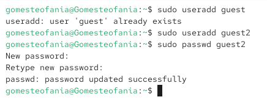
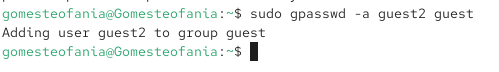
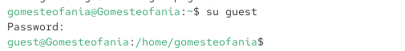
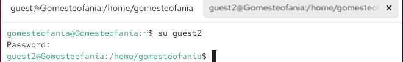
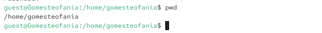
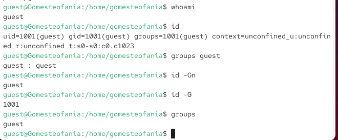
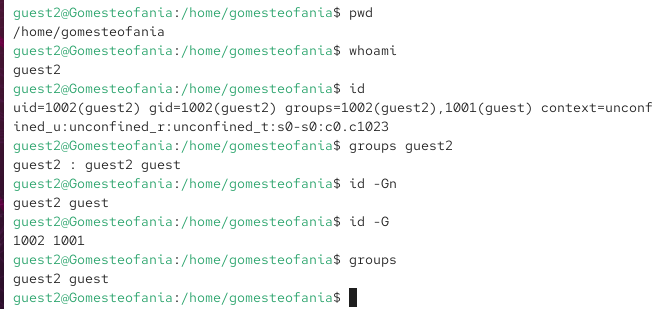
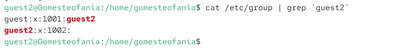
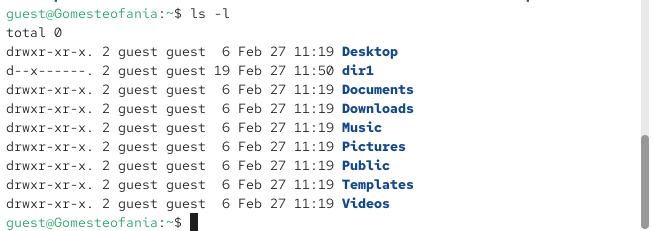
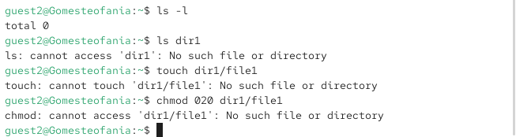

---
## Front matter
lang: ru-RU
title: Презентация по лабораторной работе 3
subtitle: Дискреционное разграничение прав в Linux.
author:
  - Гомес Лопес Теофания
institute:
  - Российский университет дружбы народов, Москва, Россия
date: 12 03 2026

## i18n babel
babel-lang: russian
babel-otherlangs: english

## Formatting pdf
toc: false
toc-title: Содержание
slide_level: 2
aspectratio: 169
section-titles: true
theme: metropolis
header-includes:
 - \metroset{progressbar=frametitle,sectionpage=progressbar,numbering=fraction}
---

# Цель работы

Получить практические навыки работы в консоли с атрибутами файлов дя групп пользоватей

# Задание

1. Создать пользователя guest2 и добавить его в группу пользователей.

# Выполнение лабораторной работы

Так как пользователь guest уже есть, я создаю guest2 и задаю ему пароль.

{#fig:001 width=70%}

## Добавление в группу

Добавляю guest2 в группу guest:

{#fig:002 width=70%}

## вход в guest

От имени guest и guest2 захожу на разных консолях используя su:

{#fig:003 width=70%}

## вход в guest

{#fig:004 width=70%}

## Комманда pwd

С помощью команды pwd определяю своё текущее местоположение.

{#fig:005 width=70%}

## Проверка guest 

{#fig:007 width=70%}

## Проверка guest 

{#fig:008 width=70%}

## содержиемое etc/group

Вывела интересующее меня содержимое файла etc/group, видно, что в группе guest два пользователя, а в группе guest2 один:

{#fig:009 width=70%}

## содержиемое etc/group

{#fig:0010 width=70%}

## вход в /home/guest

Далее добавляю права на читение, запись и исполнение пользователей группы guest:

{#fig:012 width=70%}

## Проверка изменения

{#fig:014 width=70%}

## Проверка атрибутов 

Затем от имени guest2 проверяю доступ к файлам в dir1 и на основе результатов заполняю таблицы.

{#fig:0015 width=70%}

# Выводы

В результате работы я получила навыки работы в консоли с атрибутами файлов.

