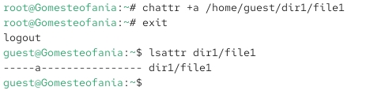
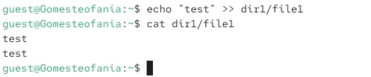
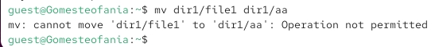
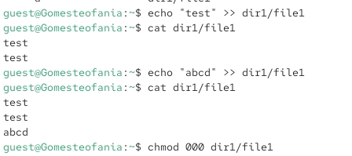

---
## Front matter
lang: ru-RU
title: Презентация по лабораторной работе 4
subtitle: Расширенные атрибуты
author:
  - Гомес Лопес Теофания
institute:
  - Российский университет дружбы народов, Москва, Россия
date: 26 03 2026

## i18n babel
babel-lang: russian
babel-otherlangs: english

## Formatting pdf
toc: false
toc-title: Содержание
slide_level: 2
aspectratio: 169
section-titles: true
theme: metropolis
header-includes:
 - \metroset{progressbar=frametitle,sectionpage=progressbar,numbering=fraction}
---

# Цель работы

Получение практических навыков работы в консоли с расширенными атрибутами файлов.

# Выполнение лабораторной работы

## атрибуты file1

Я захожу под пользователем guest и проверяю расширенные атрибуты файла dir1/file1.

{#fig:001 width=70%}

## chmod 600

Изменяю права доступа для файла с помощью chmmod 600.

{#fig:002 width=70%}

## Устаноавка атрибута

Я пытаюсь установить расширенный атрибут от имени пользователя guest, но получаю отказ в доступе

{#fig:003 width=70%}

## Устаноавка атрибута

Я перехожу под суперпользователя и устанавливаю атрибут. После этого я проверяю результат с помощью команды lsattr.

{#fig:004 width=70%}

## Дозапись в file1

Выполняю запись в файл с помощью echo.

{#fig:005 width=70%}

## Попытка переименовать файл

Получаю отказ при попытке переименовать файл. 

{#fig:006 width=70%}

## Изменение права доступа

Когда я пытаюсь изменить права доступа, я тоже получаю отказ

{#fig:007 width=70%}

## Снятие атрибут 

Снимаю расширенный атрибут с файла.

{#fig:008 width=70%}

## Проверка файла

Я выполняю проверку файла — пробую его прочитать, переименовать, изменить права доступа и запустить на выполнение.

{#fig:009 width=70%}

## 10

Далее повторяю все действия, но с расширенным атрибутом i.

{#fig:010 width=70%}

# Выводы

На практике я научилась работать с расширенными атрибутами файлов.

