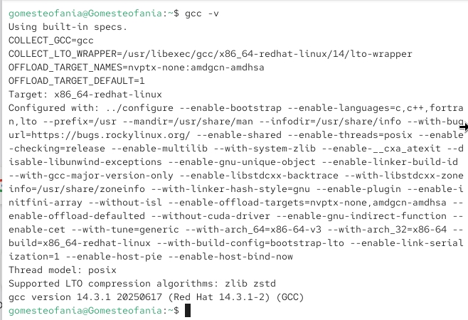
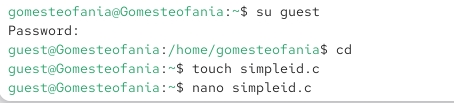
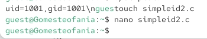
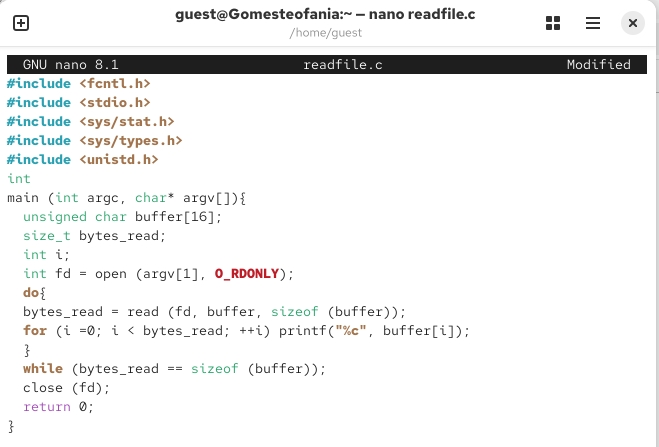
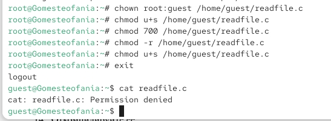
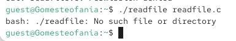
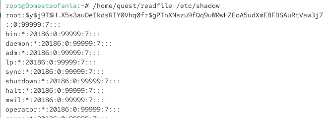
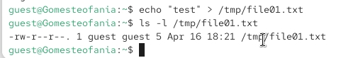
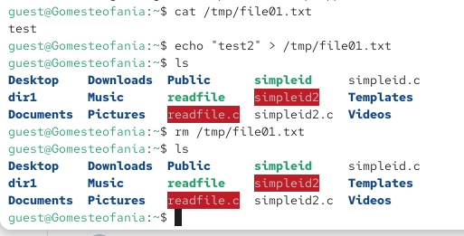

---
## Front matter
lang: ru-RU
title: Презентация по лабораторной работе 5
subtitle: Дискреционное Разграничение Прав в Linux. Исследование Влияния Дополнительных Атрибутов
author:
  - Гомес Лопес Теофания
institute:
date: 16 04 2026

## i18n babel
babel-lang: russian
babel-otherlangs: english

## Formatting pdf
toc: false
toc-title: Содержание
slide_level: 2
aspectratio: 169
section-titles: true
theme: metropolis
header-includes:
 - \metroset{progressbar=frametitle,sectionpage=progressbar,numbering=fraction}
---

# Цель работы

Изучение механизмов изменения идентификатаровб применения SetUID и Sticky-битов. Получение практических навыков работы в консоли с дополнительными атрибутами. Рассмотрение работы механизма смены идентификатора процессов пользователей, а также влияние бита Sticky на запись и удаление файлов.

# Выполнение лабораторной работы

## Проверка рабочее пространство

Перед началом работы я проверила, что средства разработки установлены:

{#fig:001 width=70%}

## Создание simpleid.c

Сначала я вошла в систему под пользователем guest, а потом создала файл simpleid.c с программой.

{#fig:002 width=70%}

## Создание simpleid.c

{#fig:003 width=70%}

## simpleid.c

Я скомпилировала и запустила программу. В ответ она показывает ID пользователя и ID группы.

{#fig:004 width=70%}

## simpleid2.c

Создала файл simpleid2.c добавив вывод действительных идентификаторов.

{#fig:005 width=70%}

## Вывод simpleid2.c

После компиляции я запускаю программу.

{#fig:006 width=70%}

## Изменение права доступа на simpleid2.c

Я использую chown, чтобы сделать владельцем файла суперпользователя, и chmod, чтобы изменить права доступа.

{#fig:007 width=70%}

## сравнение simpleid2 на id

Сравниваю вывод программы и команды id. Программа вывела только ограниченную информацию.

{#fig:008 width=70%}

## Программу readfile.c

Создала еще одну программу readfile.c

{#fig:009 width=70%}

## Смена владельца файла и прав доступа

От имени суперпользователя я снова сменила владельца файла readfile. После этого я настроила права доступа — теперь пользователь guest не может прочитать этот файл.

{#fig:010 width=70%}

## Попытка прочесть файл

Проверка прочесть файл от имени пользователя guest. Прочесть файл не удается. 

{#fig:011 width=70%}

## Попытка прочесть файл

Попытка прочесть файл shadow с помощью программы

{#fig:012 width=70%}

## Чтение файла от суперпользователя

А когда я попробовала прочитать эти же файлы от имени суперпользователя, то чтение прошло успешно (в отличие от обычного пользователя).

{#fig:013 width=70%}

## Создание файла

От имени пользователя guest создаю файл с текстом.

{#fig:014 width=70%}

## изменение права доступа

С помощью команды chmod я даю другим пользователям права читать и записывать файл

{#fig:015 width=70%}

## Проверка файл на чтение, запись и удаление 

 Прочитаю файл file01.txt,

{#fig:016 width=70%}

# Выводы

Я изучила, как работают механизмы смены идентификаторов. Я применила биты SetUID и Sticky. Я получила практические навыки работы в консоли с дополнительными атрибутами файлов. Также я рассмотрела, как происходит смена идентификатора у процессов пользователей и как бит Sticky влияет на запись и удаление файлов.

