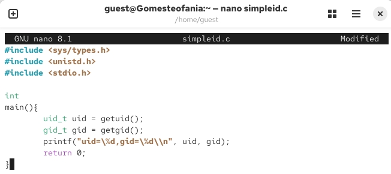
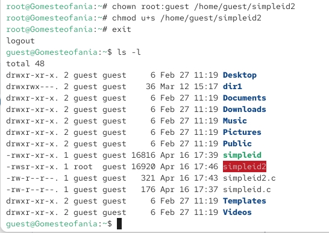
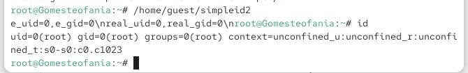
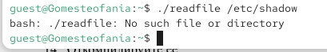
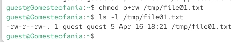

---
## Front matter
title: "Отчёт по лабораторной работе 5"
subtitle: "Дискреционное разграничение прав в Linux. Исследование влияния дополнительных атрибутов"
author: "Гомес Лопес Теофания"

## Generic otions
lang: ru-RU
toc-title: "Содержание"

## Bibliography
bibliography: bib/cite.bib
csl: pandoc/csl/gost-r-7-0-5-2008-numeric.csl

## Pdf output format
toc: true # Table of contents
toc-depth: 2
lof: true # List of figures
lot: true # List of tables
fontsize: 12pt
linestretch: 1.5
papersize: a4
documentclass: scrreprt
## I18n polyglossia
polyglossia-lang:
  name: russian
  options:
	- spelling=modern
	- babelshorthands=true
polyglossia-otherlangs:
  name: english
## I18n babel
babel-lang: russian
babel-otherlangs: english
## Fonts
mainfont: IBM Plex Serif
romanfont: IBM Plex Serif
sansfont: IBM Plex Sans
monofont: IBM Plex Mono
mathfont: STIX Two Math
mainfontoptions: Ligatures=Common,Ligatures=TeX,Scale=0.94
romanfontoptions: Ligatures=Common,Ligatures=TeX,Scale=0.94
sansfontoptions: Ligatures=Common,Ligatures=TeX,Scale=MatchLowercase,Scale=0.94
monofontoptions: Scale=MatchLowercase,Scale=0.94,FakeStretch=0.9
mathfontoptions:
## Biblatex
biblatex: true
biblio-style: "gost-numeric"
biblatexoptions:
  - parentracker=true
  - backend=biber
  - hyperref=auto
  - language=auto
  - autolang=other*
  - citestyle=gost-numeric
## Pandoc-crossref LaTeX customization
figureTitle: "Рис."
tableTitle: "Таблица"
listingTitle: "Листинг"
lofTitle: "Список иллюстраций"
lotTitle: "Список таблиц"
lolTitle: "Листинги"
## Misc options
indent: true
header-includes:
  - \usepackage{indentfirst}
  - \usepackage{float} # keep figures where there are in the text
  - \floatplacement{figure}{H} # keep figures where there are in the text
---

# Цель работы

Изучение механизмов изменения идентификатаровб применения SetUID и Sticky-битов. Получение практических навыков работы в консоли с дополнительными атрибутами. Рассмотрение работы механизма смены идентификатора процессов пользователей, а также влияние бита Sticky на запись и удаление файлов.

# Выполнение лабораторной работы

Перед началом работы я проверила, что средства разработки установлены:

{#fig:001 width=70%}

Сначала я вошла в систему под пользователем guest, а потом создала файл simpleid.c с программой.

{#fig:002 width=70%}

{#fig:003 width=70%}

Я скомпилировала и запустила программу. В ответ она показывает ID пользователя и ID группы.

{#fig:004 width=70%}

Создала файл simpleid2.c добавив вывод действительных идентификаторов.

{#fig:005 width=70%}

После компиляции я запускаю программу.

{#fig:006 width=70%}

Я использую chown, чтобы сделать владельцем файла суперпользователя, и chmod, чтобы изменить права доступа.

{#fig:007 width=70%}

Сравниваю вывод программы и команды id. Программа вывела только ограниченную информацию.

{#fig:008 width=70%}

Создала еще одну программу readfile.c

{#fig:009 width=70%}

От имени суперпользователя я снова сменила владельца файла readfile. После этого я настроила права доступа — теперь пользователь guest не может прочитать этот файл.

{#fig:010 width=70%}

Проверка прочесть файл от имени пользователя guest. Прочесть файл не удается. 

{#fig:011 width=70%}

Попытка прочесть файл shadow с помощью программы

{#fig:012 width=70%}

А когда я попробовала прочитать эти же файлы от имени суперпользователя, то чтение прошло успешно (в отличие от обычного пользователя).

{#fig:013 width=70%}

От имени пользователя guest создаю файл с текстом.

{#fig:014 width=70%}

С помощью команды chmod я даю другим пользователям права читать и записывать файл

{#fig:015 width=70%}

 Прочитаю файл file01.txt,

{#fig:016 width=70%}

# Выводы

Я изучила, как работают механизмы смены идентификаторов. Я применила биты SetUID и Sticky. Я получила практические навыки работы в консоли с дополнительными атрибутами файлов. Также я рассмотрела, как происходит смена идентификатора у процессов пользователей и как бит Sticky влияет на запись и удаление файлов.

