---
## Front matter
lang: ru-RU
title: Презентация по лабораторной работе 6
subtitle: Мандатное разграничение прав в Linux
author:
  - Гомес Лопес Теофания
institute:
  - Российский университет дружбы народов, Москва, Россия
date: 30 04 2026

## i18n babel
babel-lang: russian
babel-otherlangs: english

## Formatting pdf
toc: false
toc-title: Содержание
slide_level: 2
aspectratio: 169
section-titles: true
theme: metropolis
header-includes:
 - \metroset{progressbar=frametitle,sectionpage=progressbar,numbering=fraction}
---

# Информация


# Цель работы

Развить навыки администрирования ОС linux. Получить практическое знакомство с SELinux1. Проверить работу SELinux на практике совместно с веб-сервером Apache.


# Выполнение лабораторной работы

## проверка режима работы SELinux

Сначала я вошла в систему под своим именем. Потом я проверила SELinux: с помощью getenforce и sestatus я увидела, что режим — enforcing, а политика — targeted.

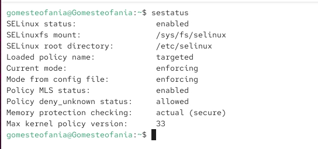{#fig:001 width=70%}

## Проверка работы Apache

Сначала я запускаю Apache. Затем с помощью браузера я проверяю доступ к веб-серверу на моём компьютере — сервер отвечает. Команда service httpd status тоже показывает, что сервер работает.

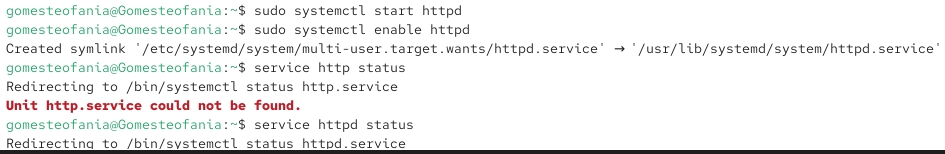{#fig:002 width=70%}

## Контекст безопасности Apache

С помощью команды ps auxZ | grep httpd нашла веб-сервер Apache в списке процессов. Его контекст безопасности - httpd_t 

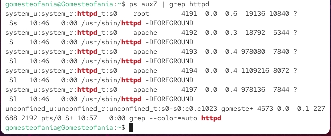{#fig:003 width=70%}

## Состояние переключателей SELinux

Я проверила, какие настройки (булевы переключатели) SELinux включены для Apache.

{#fig:004 width=70%}

## Cтатистика по политике

Я выполнила команду seinfo, чтобы посмотреть статистику политики. 

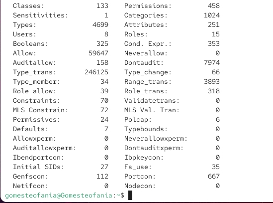{#fig:005 width=70%}

## Типы поддиректорий

С помощью команды ls -lZ /var/www я посмотрела типы поддиректорий в папке /var/www. Владелец всех директорий — root. Права на изменение есть только у владельца. Файлов в этой директории нет.

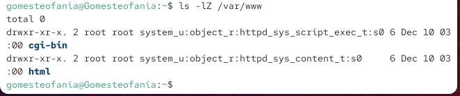{#fig:006 width=70%}

## Типы файлов

В директории /var/www/html нет файлов. 

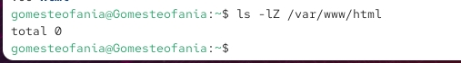{#fig:007 width=70%}

## Создание файла

Создать файл может только суперпользователь, поэтому от его имени создаем файл touch.html cо следующим содержанием:

```

<html>
<body>test</body>
</html>

```

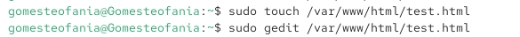{#fig:008 width=70%}

## Контекст файла

Проверяю контекст созданного файла. По умолчанию — httpd_sys_content_t.

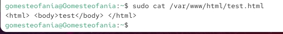{#fig:009 width=70%}

## Отображение файла

Обращаюсь к файлу через веб-сервер по адресу http://127.0.0.1/test.html. Файл отобразился успешно

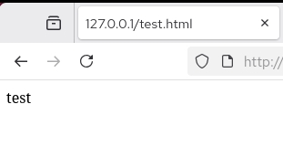{#fig:010 width=70%}

## Изучение справки по команде

Изучила справку man httpd_selinux.

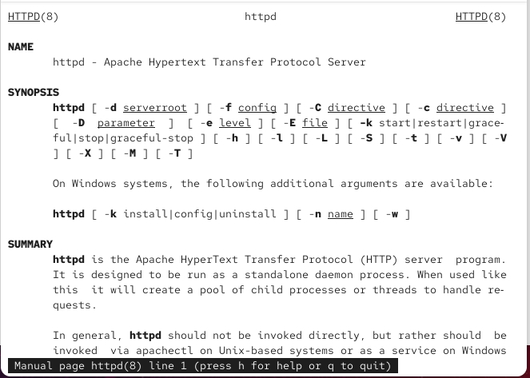{#fig:011 width=70%}

## Проверка лог-файлов

Проанализировала лог-файлы: tail -nl /var/log/messages

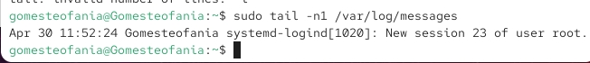{#fig:012 width=70%}

## Проверка лог-файлов

В файл error_log была записана информация.

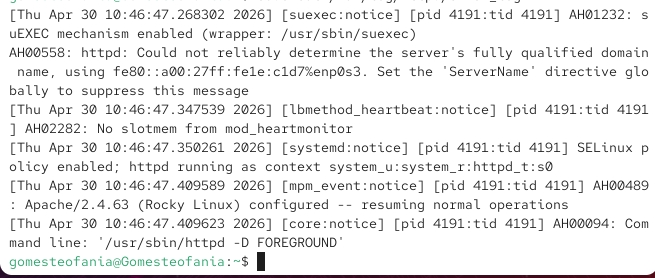{#fig:013 width=70%}

## Проверка портов

Я выполняю команду semanage port -a -t http_port_t -p tcp 81. После этого я проверяю список портов командой semanage port -l | grep http_port_t. Порт 81 появился в списке.

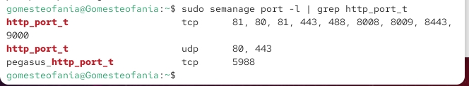{#fig:014 width=70%}

## Перезапуск сервера

Перезапускаю сервер Apache 

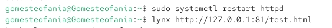{#fig:015 width=70%}

## Проверка порта 81

Сервер работает, так как порт 81 добавлен в http_port_t. Возвращаю в /etc/httpd/httpd.conf порт 80. Проверяю — порт 81 удалён.

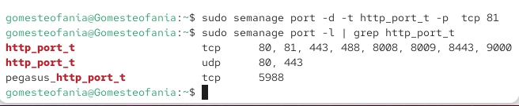{#fig:016 width=70%}

## Удаление файла

Далее удаляю файл test.html, проверяю, что он удален

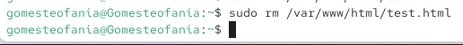{#fig:017 width=70%}


# Выводы

В результате выполнения лабораторной работы я развила навыки администрирования Linux, получила первое практическое знакомство с SELinux и проверила его работу вместе с веб-сервером Apache.


