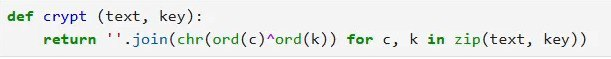
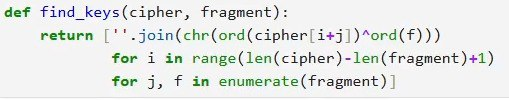
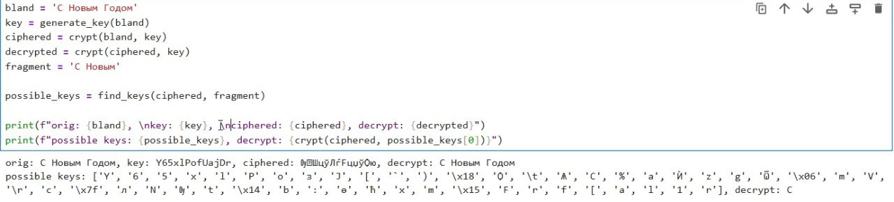

---
## Front matter
lang: ru-RU
title: Презентация по лабораторной работе 7
subtitle: Режим Однократного Гарммирования
author:
  - Гомес Лопес Теофания
institute:
  - Российский университет дружбы народов, Москва, Россия
date: 15 05 2026

## i18n babel
babel-lang: russian
babel-otherlangs: english

## Formatting pdf
toc: false
toc-title: Содержание
slide_level: 2
aspectratio: 169
section-titles: true
theme: metropolis
header-includes:
 - \metroset{progressbar=frametitle,sectionpage=progressbar,numbering=fraction}
---

# Цель работы

Освоить применение режима однократного гаммирования.

# Выполнение лабораторной работы

## Функция для генерации ключа

Я написала на Python функцию, которая создаёт случайный ключ.

{#fig:001 width=70%}

## Функция для шифрования и дешифрования

У меня получилась одна функция, которая умеет как зашифровывать, так и расшифровывать текст.

{#fig:002 width=70%}

## функция для нахождения возможных ключей

Необходимо найти ключ, при котором шифротекст превращается в фрагмент текста. Для этого создала функцию поиска возможных ключей по фрагменту.

{#fig:003 width=70%}

## Проверка

Проверила работу программы: шифрование и дешифрование выполняются верно, ключи для расшифровки фрагмента текста также находятся правильно.

{#fig:004 width=70%}

# Выводы

Выполняя эту работу, я научилась использовать режим однократного гаммирования.
